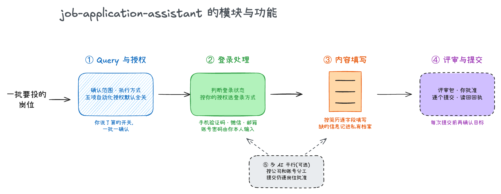
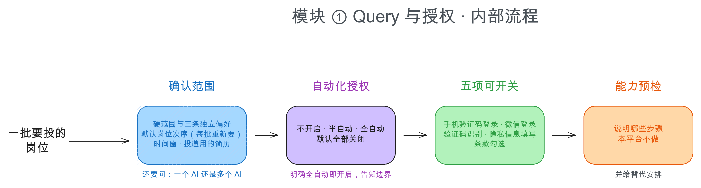
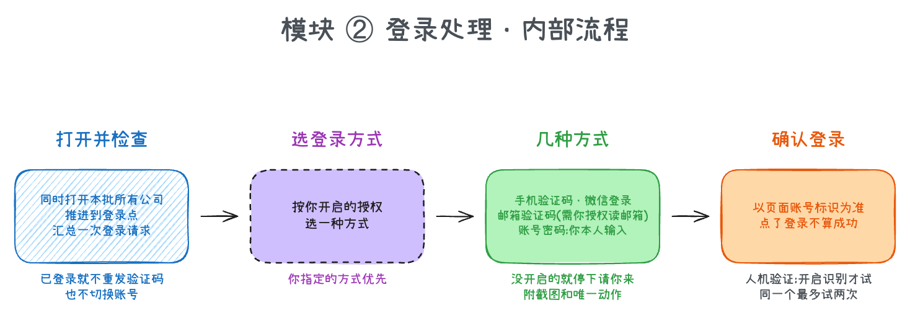
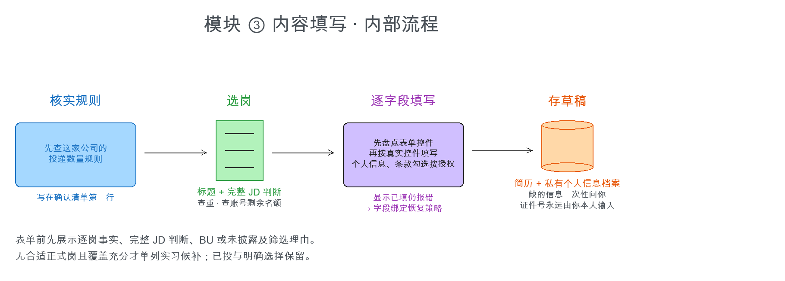
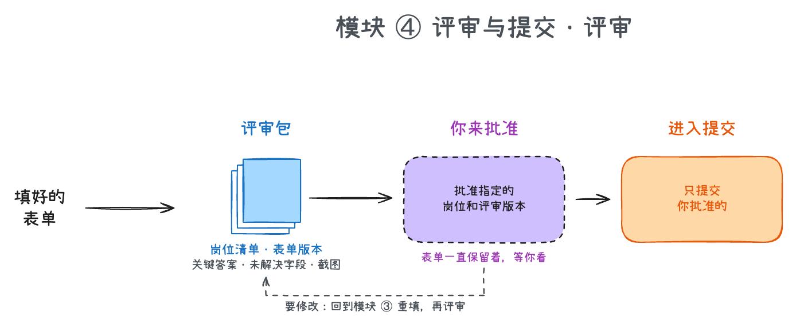
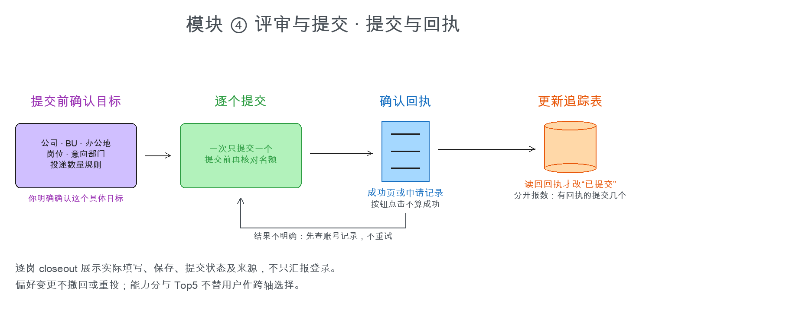
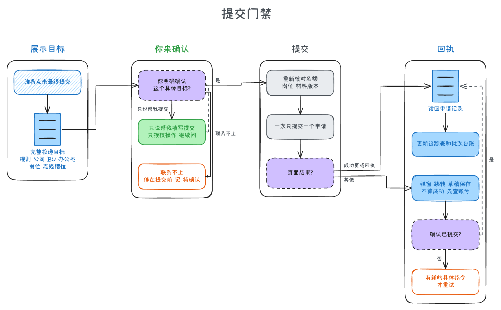
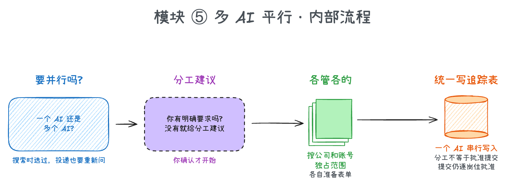

# job-application-assistant 岗位代投助手

2022 年,我刚刚进入社会,那一年我投了 70 个简历,最后拿了 10 个 offer。人们都在说"工作不好找"。2026 年,我再次回到校招,发现没有 200-300 次简历投递,很难找到同样的机会;而找工作、投简历本身,就是非常麻烦且复杂的事情。因此,我做了这个。

[`campus-job-skills`](https://github.com/SilentLake-Tech-SkillHub/campus-job-skills) 解决"找"的麻烦:逐家公司收集岗位,整理进 Excel 账本。这个仓库解决"投"的麻烦:你选好一批岗位之后,AI 帮你开页面、登录、填表、存草稿,整理成评审包给你过目;你批准了,才逐个提交,并且只有读到官方回执,才把状态改成"已提交"。面向**中国大陆的校招和实习**。

它能帮你:

- **先问清再动手**:开始前和你确认地区、届别、岗位、地点、时间窗和投递用的简历,以及由一个 AI 还是多个 AI 平行做。
- **一次汇总登录请求**:本批所有公司同时打开,推进到登录点,只向你发一次登录请求;你登录的同时,它继续推进已登录的公司。
- **先查投递数量规则**:每家公司最多能投几个岗位、能不能同时进行、志愿和变更规则怎么定,查清楚写在确认清单第一行,不会把超过上限的岗位当成都能投。
- **按你的简历逐字段填写**:先盘点页面上每个控件是什么,下拉、级联、日期都点真实选项,不靠直接赋值蒙混;简历里没有的信息,一次性问你,并记进你本地的私有档案,下次不再问。
- **评审包**:岗位清单、每份表单的版本、关键答案、未解决的字段和截图,整理好给你过目。
- **提交前再确认一次**:点最终提交之前,把公司、业务集团、办公地、岗位、意向部门逐项摆出来,等你对这个确切目标明确确认。
- **只认回执**:看到成功页或申请记录,才改追踪表。点了按钮、弹出了窗口,都不算成功。
- **多个 AI 平行准备**(可选):公司很多时,经你同意分给多个 AI,各管各的公司和账号,最后一个 AI 统一写追踪表。

所有最终提交都由你确认,任何自动化档位都不例外。

## 最终成品是什么?

每一批投递,你会得到下面这些东西:

| 产物 | 里面是什么 | 什么时候用 |
|---|---|---|
| **评审包** | 本批岗位清单、每份表单的版本、关键答案、未解决的字段、页面截图 | 批准投递之前,逐个看 |
| **岗位追踪表**(你的 Excel 求职账本) | 每个岗位的投递状态:从"待投递"改成"已提交",只在读回回执后才改 | 随时看这一批投到哪了 |
| **批次台账**(私有,在你自己的目录) | 这一批每个岗位所处的阶段和证据 | 对话中断后接着做,避免重复提交 |
| **个人信息档案**(私有,只在你本地) | 简历以外的信息,比如家庭所在地、紧急联系人、各公司的偏好 | 填表时直接取用,不用每家重复问 |

追踪表可以直接沿用 `campus-job-skills` 产出的账本。个人信息档案不在仓库里,仓库只提供一个空白模板,放在 [`skills/personal-info-vault/assets/profile-template.md`](skills/personal-info-vault/assets/profile-template.md)。

## 模块与流程

这个仓库由四个模块按顺序工作,另有一个可选的协作模块:先问清这一批的范围和授权,再处理登录,然后按简历填写表单,最后把评审包交给你批准、逐个提交。公司很多时,可以再加上多个 AI 平行。



下面逐个讲每个模块做什么、内部怎么走。

### 模块 ① Query 与授权

**它做什么:** 每一批开始前,把范围、执行方式和"哪些事可以自动做"问清楚。



AI 先问清楚这一批的范围,并分成两部分。**硬范围**是明确要排除的边界,比如地区、届别、用工性质和城市。**三条独立的偏好**是就业路径、城市和岗位方向,只决定排序,不会把岗位排除出去,遇到冲突由你取舍。它还会问这一批的**默认岗位次序**,例如 `AI产品 > 产品 > 其他`,每一批都重新问,不沿用上一批。接着问时间窗、投递用的是哪份简历,以及由一个 AI 来做,还是由多个 AI 平行做;搜索阶段选过多 AI,不代表投递阶段也选了,这里要重新确认。

接下来是**自动化授权**。有五件事默认全部关闭,要你在这一批明确开启才会做:手机验证码登录、微信登录、验证码识别、隐私信息填写、条款勾选。你可以一项都不开(这些都由你本人来),也可以只开其中几项(半自动),或者全开(全自动)。你明确选择"全自动"时,五项即已开启,它会说明边界并继续,不会再问一次是否开启。同批续跑或换执行方会读回有效授权,只补问缺失或实质变化的事项。浏览器已预填的已有账号可以点击普通登录并核对结果,不读取、保存或导出密码。短信结果和图形验证默认由你提供或完成;完整接手验证、微信私密截图交接、本次条款全部代勾,各需三次明确确认:范围、风险与最终授权。这是本 Skill 的额外流程,不能替代平台要求的具体协议披露、持续权限逐次确认或本人操作。最后它做一次能力预检,看当前这个 AI 能用浏览器、computer use、系统脚本、Playwright 中的哪些,把它自己所在平台不会做的步骤提前告诉你,并给出替代安排。

### 模块 ② 登录处理

**它做什么:** 判断现在是否已登录、登录的是哪个账号,再按你开启的授权选择登录方式。



本批所有公司同时打开,每家公司一个标签页,各自推进到登录这一步,然后向你发**一次**汇总的登录请求。你登录的时候,它继续推进已经登录好的公司。已经登录的页面不会重发验证码,也不会切换账号。

登录方式有四种:手机验证码、微信登录、邮箱验证码、账号密码。手机登录只在你开启对应授权时由 AI 填号和请求短信,默认由你提供或输入短信码;完整接手还需三次确认、具体短信来源授权和平台允许。微信由 AI 打开入口,三次确认后只在平台允许时把最少截图发到已核验的本人私密渠道,由你扫码或本人授权,AI 不点快捷确认或 OAuth“允许”;邮箱验证码只在你明确授权读取那个邮箱后才用;账号密码不由它代填;浏览器或你已填好的既有账号可以由它点击普通登录并核对结果,缺失或错误时才请你处理。你没开启的方式,它停在那一步,附上截图,告诉你唯一需要做的动作。网站只支持某一种方式时,按网站实际情况来;你指定了方式,就优先用你指定的。

登录过程中的普通验证点击可在已开启的授权内由 AI 完成,图形挑战默认交给你本人;你明确要求完整接手并完成三次确认后,它才在平台允许范围内用 computer use 尝试,同一个验证最多试两次,不行就交还给你。最后以页面上的账号标识为准确认登录成功,点了"登录"本身不算成功。

### 模块 ③ 内容填写

**它做什么:** 按你指定的简历,把表单逐字段填好并存成草稿,不动最终提交。



每家公司开始之前,AI 先把这家公司的岗位包汇报给你:公司、BU(没披露就写没披露)、办公地、岗位和直达链接,然后问一句,相对这一批的默认次序有没有变动。你确认之后才继续,登录成功或上一批的确认都不能代替这一步。这份汇报和后面评审用的是同一份逐岗报告,不会另外再建一份清单。接着它查这家公司的投递数量规则:最多能投几个、能不能同时进行、志愿和变更规则怎么定,写在确认清单的第一行。再按"标题加完整 JD"选岗,并查账号里的申请历史和剩余名额,避免重复。

填表前先盘点页面上所有控件,为每个字段建一张操作表:下拉和级联要打开并点击真实选项,日期用真实日期面板,上传用文件控件。内容默认取自你指定的投递简历,不会擅自换成旧简历或网站自动解析出来的内容。简历里没有的信息,先查你的私有档案,仍然缺失就一次性问你,你回答的当场就写进档案。个人与联系信息只在你开启对应授权时由 AI 来填。条款先问你逐项查看,还是在本次已确认求职范围内全部代勾;全部代勾需三次确认,已覆盖普通项不再逐项问。具体新协议仍按平台要求先披露并取得接受,持续权限逐次确认和本人操作边界保留;身份证号、护照号这类证件号码永远由你本人在页面输入,它不代填、不保存、不复述。

遇到页面显示已填但仍然报必填、值在联动后消失这类情况,它会先核对字段身份,再换实际可用的操作方式恢复,不会靠提交去试错。填好的内容存为网站草稿。

### 模块 ④ 评审与提交

**它做什么:** 把填好的表单整理成评审包给你批准,批准后逐个提交,并只认官方回执。这个模块有两张图:评审,和提交与回执。



草稿都存好之后,AI 把评审包交给你,按岗位逐个展示:先是公司、岗位和直达链接,再是 BU、城市和用工性质,最后是判断理由,以及填写、保存、提交各做到了哪一步和对应的证据,只登录不算准备完成。另外还有本批岗位清单、每份表单的版本、关键答案、仍未解决的字段和页面截图。实习转正按你在私有配置里的选择处理:选了"转正排最后",官方明确写了转正机会的实习就和其他岗位放在同一份报告里,排在最后。表单一直保留在浏览器里,方便你对着看。你批准的是**指定的岗位和评审版本**,不是笼统的"都可以投"。要修改的地方,它回到模块 ③ 改,再给你新版本。



得到你批准之后,每次点最终提交之前,还有一道**提交前目标确认门禁**,下面这张图是它的细节:



它把投递数量规则、公司与账号、业务集团或招聘主体、办公地、岗位、意向部门或志愿槽位逐项摆给你,等你对这个确切目标明确确认。一句"帮我填写打勾提交"只授权操作,不满足这道门禁;意向部门、志愿顺序这类选择权属于你,AI 只能列出选项和理由,不会替你选。你一时联系不上,它就停在提交前,记成"待确认"。这样做是因为不少网站投递后无法撤回,有的还会让对应业务集团本季不再接收简历,所以这道门禁不会被任何自动化档位覆盖。

确认之后,它一次只提交一个申请,提交前再核对一次名额、岗位和材料版本。提交后以成功页或申请记录为准,读回来之后才把追踪表改成"已提交"。结果不明确时,先查账号里的申请记录,再决定怎么处理,不会直接重试。最后分开报数:查了几家公司、核验了几个岗位、准备了几份表单、有回执的提交几个、有多少是结果不明确或被卡住的。

### 模块 ⑤ 多 AI 平行(可选)

**它做什么:** 公司很多时,经你同意把准备工作分给多个 AI,各管各的公司和账号,最后统一写追踪表。



它先问你是一个 AI 还是多个;搜索时选过也要在投递时重新确认。选了多个之后,它会问你对人数、分工、优先级、时间有没有明确要求,没有就给你一份分工建议,你确认了才开始。每个 AI 按公司和账号各管一段独占的范围,各自准备表单;最后由一个 AI 按顺序统一写追踪表,避免同时改同一个文件。每个 AI 交回的结果都带着偏好版本号,和当前版本对不上的会被拒收。分工建议不等于批准提交,提交仍然按岗位逐个确认。

## 我应该准备什么材料?

1. **一份岗位追踪表**(Excel)。没有的话,先用 [`campus-job-skills`](https://github.com/SilentLake-Tech-SkillHub/campus-job-skills) 把岗位收集进来。
2. **一份已确认的投递简历**,以及你的项目集或作品集(如果表单要用)。
3. **复制 Skill,并在你自己的目录里准备私有配置和个人信息档案**(档案从空白模板复制,别放进 Skill 目录)。

然后对 AI 说一句"帮我把这一批岗位准备投递"就行。

## 我可以在哪些工具上使用?

有三种用法,按推荐程度从高到低排列。

### 用法一(最推荐): Codex /  Claude Code + computer use

这是效果最好的一种。把推理强度开到 medium,再打开 computer use(让 AI 直接操作你的电脑和浏览器),登录、填表、上传简历、读回回执它都能做。短信结果和图形验证默认由你提供或完成;你也可以在模块 ① 明确要求完整接手并完成三次确认,让它在平台允许范围内处理。图形挑战用 computer use 尝试,同一个验证最多试两次,不行就交还给你。

**推荐:让 AI 帮你安装。** 把这个仓库交给 AI,说"帮我把这个 Skill 装好"。

**手动安装:**

| 工具 | 复制到 | 装好后的完整路径示例 |
|---|---|---|
| Claude Code | 用户目录 `~/.claude/skills/` | `~/.claude/skills/job-application-assistant/SKILL.md` |
| Codex | 用户目录 `~/.codex/skills/`(或项目里的 `.agents/skills/`) | `~/.codex/skills/job-application-assistant/SKILL.md` |

把整个仓库目录复制过去,目录名用 `job-application-assistant`。里面九个子 Skill(登录、验证码、填写、多 AI 平行等)在 `skills/` 下,跟着一起复制即可。

### 用法二: Cue /  OpenAI Dots,直接挂给个人 Agent

把 Skill 直接挂到你的个人 Agent 上,它做一个、向你汇报一个。适合不想盯着屏幕、只想看进度汇报的人。

### 用法三(可以用,但不推荐): Kimi /  GLM +  Browser use /  Playwright

用 Kimi、GLM 这类模型,搭配 Browser use 或 Playwright 来操作浏览器,也能跑通。但不推荐:这类组合有时识别网页元素不准,模型本身的能力也不强。填表出错的代价比收集岗位更高,所以你在评审阶段要看得更仔细。

## 使用技巧

**怎么指挥 AI**

- **开新一批**:说"帮我把这一批岗位准备投递",它先走模块 ① 向你确认。每一批的选择只对这一批有效,上一批的授权不会自动沿用。
- **自动化授权怎么选**:一项都不开,登录、个人信息、勾选都由你来;半自动只开你放心的几项,其余仍然由你;全自动是五项全开,仍保留各分支的三次确认、平台要求及本人操作。无论哪一档,"最终提交前确认目标"这一步都不会省。
- **公司多的时候用多 AI**:选了多个 AI 之后,它先给你一份分工建议,你确认了才开始;每个 AI 各管各的公司和账号,最后由一个 AI 统一写追踪表,避免同时改同一个文件。分工建议不等于批准提交,提交仍然按岗位逐个确认。
- **对话中断了怎么办**:让它重新读取批次台账、追踪表和网站上的实际状态,先弄清哪些岗位已经提交、哪些结果不明确,再继续,不会凭记忆重复提交。
- **随时补信息**:对话里直接告诉它新的个人信息或偏好,它当场写进你的私有档案。你改了某个值,它更新取值,不会再沿用你已经否定的旧值。

**每类产物怎么用**

- **评审包**:逐个岗位核对关键答案和未解决字段,只批准你确认过的版本。
- **追踪表**:筛"待投递"看还剩哪些,筛"已提交"看哪些已经有回执。
- **批次台账**:出现"结果不明确"的岗位时先看它,再去网站上核对。

## FAQ

**它会自动帮我点提交吗?** 不会。每次点最终提交之前,都要你对这个具体的公司、业务集团、办公地、岗位和志愿槽位明确确认。这一步在任何自动化档位下都不会被跳过。

**实习转正怎么处理?** 由你在私有配置里选:可以不收实习,可以单独成一批,也可以只收官方明确写了转正机会的实习,和其他岗位放在同一份报告里,排在最后。普通实习不在范围内,转正说得含糊的会标成待核。

**验证码怎么办?** 普通验证点击可在已开启的授权内由 AI 完成;短信结果默认由你提供或输入,图形挑战默认由你完成。完整接手需三次明确确认,说明范围、验证失败和风控风险,并取得最终授权;短信还需指定来源权限,所有操作都须符合平台要求。图形挑战同一个验证最多试两次,连续弹出验证或提示"操作频繁"时暂停这个网站,先做其他公司,不会换 IP、伪造指纹或换通道绕过限制,也不保存验证码。

**我的身份证号会被保存吗?** 不会。证件号码始终由你本人在页面输入,AI 不代填、不保存、不复述。

**我的个人信息会进仓库吗?** 不会。个人信息档案放在你自己的目录里,仓库只提供空白模板,并且用 `.gitignore` 兜底,档案文件不会被误提交。

**一家公司只让投一个岗位怎么办?** 开始选岗之前,它先查这家公司的投递数量规则(最多投几个、能不能同时进行、能不能改),写在确认清单的第一行。可投数量少于你想投的岗位时,会在同一份清单里问你用哪几个。查不到规则时标"未核实",并在第一次提交后立刻读回账号状态,再动这家公司的下一个岗位。

**边界:** 只用你指定的投递简历和你提供的事实,不推断;证件号码和金融账户信息由你本人处理;不保存密码、验证码、Cookie;不撤回、不删除、不重复提交,除非你有新的明确指令;网站状态和追踪表对不上时,先查账号记录,不批量改状态。

## 附录:文件结构

```text
job-application-assistant/
├── README.md
├── SKILL.md                              入口:Query、准备、评审、提交四个阶段与硬门禁
├── agents/openai.yaml
├── docs/
│   ├── images/icons/                     README 里的工具图标
│   └── flow/                             模块总览图、各模块的内部流程图、提交门禁细节图
├── references/
│   ├── automation-authorization.md       自动化授权的提问、档位与记录
│   ├── automation-continuity.md          能力预检与连续推进
│   ├── browser-application.md            操作招聘网站的规则
│   ├── control-preflight.md              表单控件盘点与操作方案
│   ├── daily-batch.md                    批次 Query 字段与断点续跑记录
│   ├── field-binding-recovery.md         字段显示已填仍报错时的恢复策略
│   ├── preparation-scenarios.md          维护用的场景检查
│   └── workbook-contract.md              岗位追踪表的读写约定
├── scripts/
│   ├── inspect_form_controls.js          只读盘点页面控件
│   ├── validate_batch.py                 批次台账的确定性校验
│   └── test_*                            上述脚本的测试
└── skills/
    ├── application-login/                判断登录状态,按你的授权选登录方式
    ├── login-phone-otp/                  手机验证码登录(需开启)
    ├── login-wechat/                     微信私密截图交接(需开启、三次确认,本人授权)
    ├── captcha-solve/                    图形验证默认交接(完整接手需三次确认)
    ├── privacy-info-fill/                个人与联系信息填写(需开启)
    ├── terms-consent/                    条款逐项查看或本次代勾(后者需三次确认)
    ├── personal-info-vault/              私有个人信息档案规则与空白模板
    ├── application-content-fill/         按简历逐字段填写与读回
    └── application-parallel-execution/   多个 AI 平行准备的协作
```

本仓库由 [SilentLake-Tech-SkillHub](https://github.com/SilentLake-Tech-SkillHub) 维护。
